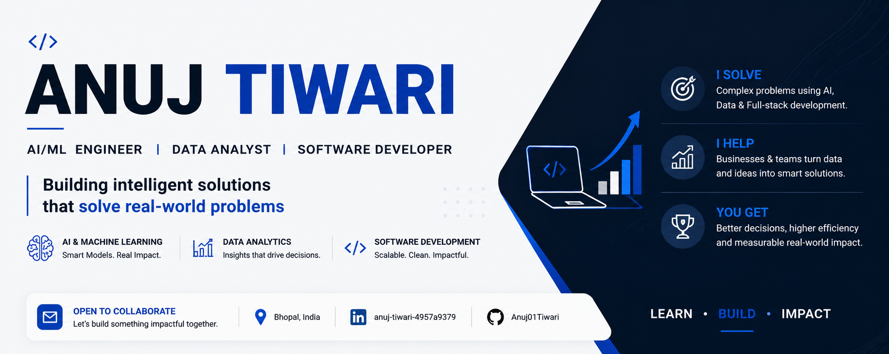

Hi 👋, I'm Anuj Tiwari

AI/ML • Data Analytics • Software Development

Building practical AI systems, data-driven applications, and intelligent software solutions.

👨‍💻 About Me

🤖 Primary focus: Artificial Intelligence & Machine Learning

🧠 Exploring Deep Learning, Computer Vision, NLP & Generative AI

🔗 Building Agentic AI workflows with LangGraph and LLM-based systems

📊 Working with Data Analytics, SQL and data-driven applications

⚙️ Developing applications and APIs with FastAPI, Flask and React

🚀 Learning by building practical projects and turning ideas into working systems

🛠️ Tech Stack

🤖 AI / Machine Learning

🧠 Deep Learning & Computer Vision

🗣️ NLP & Text Intelligence

📊 Data & Analytics

⚙️ Development

🔧 Tools

🚀 Featured Projects

🩻 Chest X-Ray Disease Classification

PyTorch • ResNet-50 • Grad-CAM • Gradio

Explainable multi-class X-ray classification system for Normal, Pneumonia, COVID-19 and Tuberculosis.

Highlights:

5,800+ X-ray images

85%+ classification accuracy

0.95 weighted AUC

Transfer learning with ResNet-50

Data augmentation and class-weighted training

Grad-CAM for visual model explanations

Interactive inference interface with Gradio

🤖 LangGraph SQL Agent

LangGraph • Groq • FastAPI • React • SQL

AI-powered analytics agent that converts natural-language questions into SQL, executes queries, and generates contextual analytical responses.

Highlights:

Natural-language → SQL workflow

Query validation and table selection

Agentic routing and response synthesis

Streaming responses with SSE

Interactive Vega-Lite visualizations

React frontend + FastAPI backend

📉 Customer Churn Prediction

Python • Scikit-learn • XGBoost • SHAP • React

End-to-end ML application for predicting customer churn from the IBM Telco Customer Churn dataset.

Highlights:

7,043 customer records

Feature engineering and exploratory analysis

XGBoost classification

SHAP-based explainability

Interactive React prediction interface

🧩 AI Form Automation

Python • Playwright • AI Agents • REST APIs

AI-assisted form automation workflow designed to understand form fields, collect information conversationally, and automate browser-based form filling.

🧠 Current Focus

AI → Machine Learning → Deep Learning → Computer Vision → NLP → Generative AI → Agentic AI → Data Analytics → Production-ready AI Applications

📊 GitHub Activity

Your GitHub contribution calendar below this README remains the source of truth for activity.

🧪 Contribution Graph Demo

Educational simulation only: this section is a visual demo of how a denser contribution graph can look. It does not change GitHub's real contribution count.

| | | | | | | | | | | | | | | | | | | | | | | | | | | | | | | | | | | | | | | | | | | | | | | | | | | | | | | | |
|---|---|---|---|---|---|---|---|---|---|---|---|---|---|---|---|---|---|---|---|---|---|---|---|---|---|---|---|---|---|---|---|---|---|---|---|---|---|---|---|---|---|---|---|---|---|---|---|---|---|---|
|🟩|🟩|⬜|🟩|🟩|🟩|⬜|🟩|🟩|⬜|🟩|🟩|🟩|⬜|🟩|🟩|⬜|🟩|🟩|🟩|⬜|🟩|🟩|⬜|🟩|🟩|🟩|⬜|🟩|🟩|⬜|🟩|🟩|🟩|⬜|🟩|🟩|⬜|🟩|🟩|🟩|⬜|🟩|🟩|⬜|🟩|🟩|🟩|⬜|🟩|🟩|⬜|🟩|
|🟩|⬜|🟩|🟩|🟩|⬜|🟩|🟩|⬜|🟩|🟩|🟩|⬜|🟩|🟩|⬜|🟩|🟩|🟩|⬜|🟩|🟩|🟩|⬜|🟩|🟩|⬜|🟩|🟩|🟩|⬜|🟩|🟩|⬜|🟩|🟩|🟩|⬜|🟩|🟩|⬜|🟩|🟩|🟩|⬜|🟩|🟩|⬜|🟩|🟩|🟩|⬜|🟩|
|⬜|🟩|🟩|🟩|⬜|🟩|🟩|⬜|🟩|🟩|🟩|⬜|🟩|🟩|⬜|🟩|🟩|🟩|⬜|🟩|🟩|⬜|🟩|🟩|🟩|⬜|🟩|🟩|⬜|🟩|🟩|🟩|⬜|🟩|🟩|⬜|🟩|🟩|🟩|⬜|🟩|🟩|⬜|🟩|🟩|🟩|⬜|🟩|🟩|⬜|🟩|🟩|🟩|⬜|
|🟩|🟩|⬜|🟩|🟩|🟩|⬜|🟩|🟩|⬜|🟩|🟩|🟩|⬜|🟩|🟩|⬜|🟩|🟩|🟩|⬜|🟩|🟩|⬜|🟩|🟩|🟩|⬜|🟩|🟩|⬜|🟩|🟩|🟩|⬜|🟩|🟩|⬜|🟩|🟩|🟩|⬜|🟩|🟩|⬜|🟩|🟩|🟩|⬜|🟩|🟩|⬜|🟩|
|🟩|⬜|🟩|🟩|🟩|⬜|🟩|🟩|⬜|🟩|🟩|🟩|⬜|🟩|🟩|⬜|🟩|🟩|🟩|⬜|🟩|🟩|🟩|⬜|🟩|🟩|⬜|🟩|🟩|🟩|⬜|🟩|🟩|⬜|🟩|🟩|🟩|⬜|🟩|🟩|⬜|🟩|🟩|🟩|⬜|🟩|🟩|⬜|🟩|🟩|🟩|⬜|🟩|
|⬜|🟩|🟩|⬜|🟩|🟩|⬜|🟩|🟩|🟩|⬜|🟩|🟩|⬜|🟩|🟩|⬜|🟩|🟩|🟩|⬜|🟩|🟩|⬜|🟩|🟩|⬜|🟩|🟩|🟩|⬜|🟩|🟩|⬜|🟩|🟩|🟩|⬜|🟩|🟩|⬜|🟩|🟩|🟩|⬜|🟩|🟩|⬜|🟩|🟩|🟩|⬜|🟩|

🐍 Contribution Snake

<picture>
  <source media="(prefers-color-scheme: dark)" srcset="https://raw.githubusercontent.com/Anuj01Tiwari/Anuj01Tiwari/output/github-snake-dark.svg">
  <source media="(prefers-color-scheme: light)" srcset="https://raw.githubusercontent.com/Anuj01Tiwari/Anuj01Tiwari/output/github-snake.svg">
  
</picture>

📜 Certifications

AI/ML Internship Completion Certificate — MPSEDC

Core Java Programming — NPTEL

Departmental Magazine Design & Leadership Certificate — UIT, RGPV

🤝 Let's Connect

💡 Building practical AI systems that solve real-world problems.

Learn • Build • Improve

