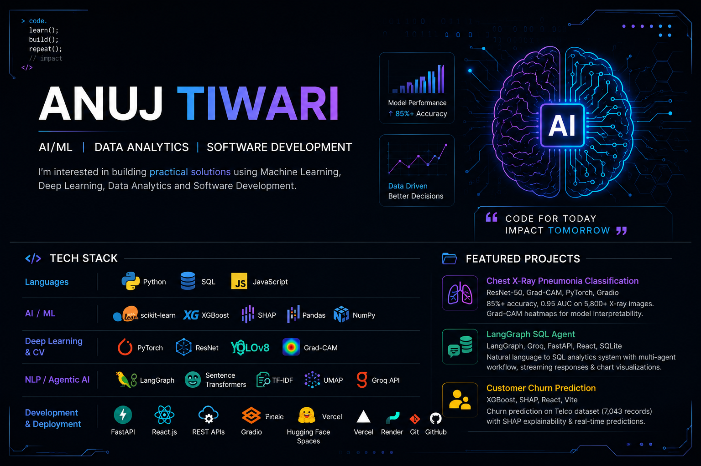

<div align="center">



# Hi 👋, I'm Anuj Tiwari

### AI/ML | Data Analytics | Software Development

**Machine Learning / AI Engineer** focused on building practical AI systems, data-driven applications, and intelligent software solutions.

<a href="https://github.com/Anuj01Tiwari">
  
</a>
<a href="https://www.linkedin.com/in/anuj-tiwari-4957a9379/">
  
</a>

</div>

---

## 👨‍💻 About Me

* 🤖 Focused primarily on **Artificial Intelligence & Machine Learning**
* 🧠 Interested in **Deep Learning, NLP, Computer Vision and Agentic AI**
* 📊 Building practical solutions using **Machine Learning and Data Analytics**
* ⚙️ Experienced with **LangGraph-based AI workflows and REST APIs**
* 🚀 Interested in deploying real-world AI applications
* 💡 Currently strengthening my skills across **AI/ML, Data and Software Development**

---

## 🛠️ Tech Stack

### 💻 Languages

<p>


</p>

### 🤖 Machine Learning

<p>


</p>

### 🧠 Deep Learning & Computer Vision

<p>


</p>

### 🗣️ NLP & Agentic AI

<p>


</p>

### 📊 Data & Visualization

<p>


</p>

### ⚙️ Development & Deployment

<p>


</p>

### 🔧 Tools

<p>


</p>

---

# 🚀 Featured Projects

## 🩻 Chest X-Ray Pneumonia Classification

**PyTorch • ResNet-50 • Grad-CAM • Gradio • Hugging Face Spaces**

Deep learning system for classifying chest X-rays into **Normal, Viral Pneumonia and Bacterial Pneumonia** using transfer learning with ResNet-50.

**Highlights:**

* 85%+ classification accuracy
* 0.95 weighted AUC
* Compared classical ML with deep CNN approaches
* Used class-weighted loss and data augmentation
* Implemented Grad-CAM for model interpretability
* Deployed interactive inference application using Gradio

---

## 🤖 LangGraph SQL Agent

**Python • LangGraph • Groq • FastAPI • SQLite • React**

Multi-agent AI analytics system that converts **natural-language questions into executable SQL queries** and generates contextual analytical responses.

**Highlights:**

* Intent routing
* SQL query generation
* SQL validation
* Table selection
* Response synthesis
* Streaming responses using SSE
* Real-time chart generation with Vega-Lite
* React frontend + FastAPI backend
* Deployed using Vercel and Render

---

## 📉 Customer Churn Prediction

**Python • XGBoost • SHAP • React • Vite**

End-to-end machine learning application for predicting customer churn using the IBM Telco Customer Churn dataset.

**Highlights:**

* 7,043 customer records
* XGBoost classification model
* Feature engineering and EDA
* SHAP-based model explainability
* Real-time prediction interface
* React/Vite frontend

---

# 🧠 What I'm Currently Working On

```text
Artificial Intelligence
        ↓
Machine Learning
        ↓
Deep Learning
        ↓
NLP + Agentic AI
        ↓
Data Analytics
        ↓
Production-ready AI Applications
```

I'm continuously improving my understanding of machine learning, deep learning, AI agents, data analytics and software development by building practical projects.

---

# 📊 GitHub Analytics

<div align="center">


</div>

---

# 🔥 GitHub Streak

<div align="center">


</div>

---

# 📈 Contribution Graph

<div align="center">


</div>

---

# 📚 Certifications

* **AI/ML Internship Completion Certificate — MPSEDC**
* **Core Java Programming — NPTEL**
* **Departmental Magazine Design & Leadership Certificate — UIT, RGPV**

---

# 🤝 Let's Connect

<div align="center">

<a href="https://www.linkedin.com/in/anuj-tiwari-4957a9379/">

</a>

<a href="https://github.com/Anuj01Tiwari">

</a>

<a href="mailto:anujptiwari1@gmail.com">

</a>

</div>

---

<div align="center">

### 💡 Building AI systems that solve real-world problems.

**Code for today. Impact tomorrow.**

</div>
